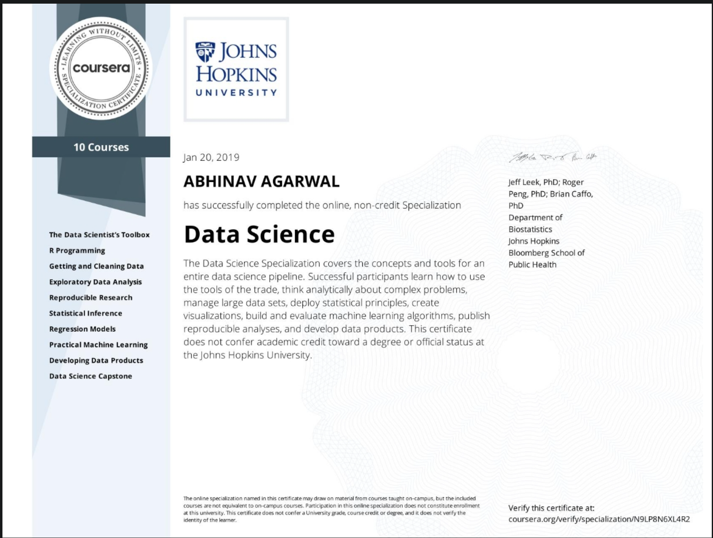
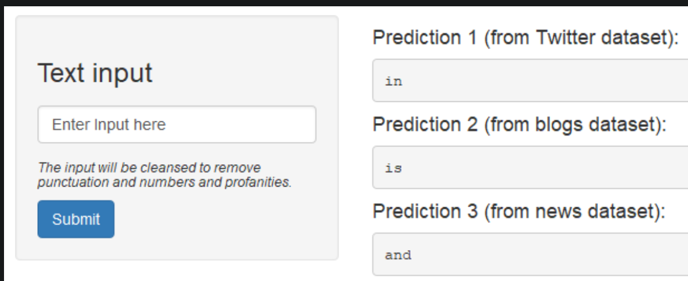

<!--
*** Thanks for checking out the Best-README-Template. If you have a suggestion
*** that would make this better, please fork the repo and create a pull request
*** or simply open an issue with the tag "enhancement".
*** Thanks again! Now go create something AMAZING! :D
-->

<!-- PROJECT SHIELDS -->
<!--
*** I'm using markdown "reference style" links for readability.
*** Reference links are enclosed in brackets [ ] instead of parentheses ( ).
*** See the bottom of this document for the declaration of the reference variables
*** for contributors-url, forks-url, etc. This is an optional, concise syntax you may use.
*** https://www.markdownguide.org/basic-syntax/#reference-style-links
-->

[![Forks][forks-shield]][forks-url]
[![Stargazers][stars-shield]][stars-url]
[![Issues][issues-shield]][issues-url]
[![MIT License][license-shield]][license-url]
[![LinkedIn][linkedin-shield]][linkedin-url]

<!-- PROJECT LOGO -->
 

  

  <h3 align="center">Data Science Specialization</h3>

  

This repository talks about my learnings through coursework and projects that I completed in JHU data science with R specialization.    
  

# Table of contents

- [About The Specialization](#about-the-specialization)
- [List of Courses and Things Learnt](#list-of-courses-and-things-learnt)
- [Capstone Project](#capstone-project)
- [Further Recommended Readings](#further-recommended-readings)

<!-- ABOUT THE PROJECT -->
## About The Specialization

  

This Data Science with R specialization is an introductory level 10-course specialization offered by renowned professors from the Johns Hopkins University. This specialization teaches one the fundamental concepts and techniques to provide the perfect platform for getting started with Data Science.

### Built With

I learned and made use of the following R packages in this specialization:

* [ggplot2](https://ggplot2.tidyverse.org/)
* [dplyr](https://cran.r-project.org/web/packages/dplyr/vignettes/dplyr.html)
* [caret](https://topepo.github.io/caret/)
* [Shiny](https://shiny.rstudio.com/)

<!-- GETTING STARTED -->
## List of Courses and Things Learnt

### Course 1. [The Data Scientist's Toolbox](https://www.coursera.org/account/accomplishments/certificate/RV35RHYC6F92)
 
* Overview of  *data*, *questions*, and *tools* that data scientists work with.
* Introduction to *version control*, *markdown*, *git*, *GitHub*, *R*, and *RStudio*.

### Course 2. [R Programming](https://www.coursera.org/account/accomplishments/certificate/84W9RR75JJTS)

* Installation and configuration of R
* Programming in R, *reading data* into R, *accessing R packages*, writing R *functions*, *debugging, profiling* R code, and *organizing and commenting* R code

### Course 3. [Getting and Cleaning Data](https://www.coursera.org/account/accomplishments/certificate/K3GSD9VTA7PW)

* Obtaining data from the web, from *APIs*, from *databases* in *various formats*
* Basics of *data cleaning* and *data sharing* 
* Data components such as *raw data*, *processing instructions*, *codebooks*, and *processed data*. 

 ### Course 4. [Exploratory Data Analysis](https://www.coursera.org/account/accomplishments/certificate/9SDW2XLE6VBV)
 
 * Essential *exploratory techniques* for *summarizing data*
 * *Plotting systems in R*, *basic principles of constructing data graphics*
 * *Multivariate statistical techniques* used *to visualize* high-dimensional data     

 ### Course 5. [Reproducible Research](https://www.coursera.org/account/accomplishments/certificate/4TDY4NLQM8DZ)
 
 *  *Reporting* data analyses in a *reproducible manner*
 *  *knitr* R library

### Course 6. [Statistical Interference](https://www.coursera.org/account/accomplishments/certificate/Z8JL3YMTETU5)
 
 *  Drawing *conclusions* about *scientific truths* from data.
 *  *Bayesian* and *likelihood* theories
 * Resolving *missing data*, observed and unobserved *confounding*, *biases*

### Course 7. [Regression Models](https://www.coursera.org/account/accomplishments/certificate/93XNKX9KHYNN)
 
 * *Regression analysis*, *least squares* and inference using regression models
 * *ANOVA and ANCOVA*, *analysis of residuals and variability* 
 * *Model selection methods*
 * *Scatterplot Smoothing*

### Course 8. [Practical Machine Learning](https://www.coursera.org/account/accomplishments/certificate/D3FSLLQYZ6LW)
 
 * Basic components of *building and applying prediction functions* for real world applications.
 * *Training and tests sets*, *overfitting*, *error rates*, *feature creation* and *evaluation*.
 * *Regression*, *classification trees*, *Naive Bayes*, and *random forests*.

### Course 9. [Developing Data Products](https://www.coursera.org/account/accomplishments/certificate/NME7BCC6NVNL)
 
 *  Drawing *conclusions* about *scientific truths* from data.
 *  *Bayesian* and *likelihood* theories
 * Resolving *missing data*, observed and unobserved *confounding*, *biases*

<!-- USAGE EXAMPLES -->

## Capstone Project

[Capstone Presentation](http://rpubs.com/anshabhi/capstone)

[Live Deployment](https://anshabhi.shinyapps.io/Shiny/)

  

The Capstone Project was building a next word prediction app using a commerical dataset provided by SwiftKey. 

The app is available with live demo at the above URL. This is a R Shiny app.

The Capstone Presentation contains more details about the how the model works. This presentation was made using R Markdown.

## Further Recommended Readings
* [Data Science Specialization Course Notes](https://sux13.github.io/DataScienceSpCourseNotes/)

<!-- MARKDOWN LINKS & IMAGES -->
<!-- https://www.markdownguide.org/basic-syntax/#reference-style-links -->
[forks-shield]: https://img.shields.io/github/forks/anshabhi/JHU-R-Data-Science.svg?style=for-the-badge
[forks-url]: https://github.com/anshabhi/JHU-R-Data-Science/network/members
[stars-shield]: https://img.shields.io/github/stars/anshabhi/JHU-R-Data-Science.svg?style=for-the-badge
[stars-url]: https://github.com/anshabhi/JHU-R-Data-Science/stargazers
[issues-shield]: https://img.shields.io/github/issues/anshabhi/JHU-R-Data-Science.svg?style=for-the-badge
[issues-url]: https://github.com/anshabhi/JHU-R-Data-Science/issues
[license-shield]: https://img.shields.io/github/license/anshabhi/JHU-R-Data-Science.svg?style=for-the-badge
[license-url]: https://github.com/anshabhi/JHU-R-Data-Science/blob/master/LICENSE
[linkedin-shield]: https://img.shields.io/badge/-LinkedIn-black.svg?style=for-the-badge&logo=linkedin&colorB=555
[linkedin-url]: https://linkedin.com/in/mrabhinavagarwal

